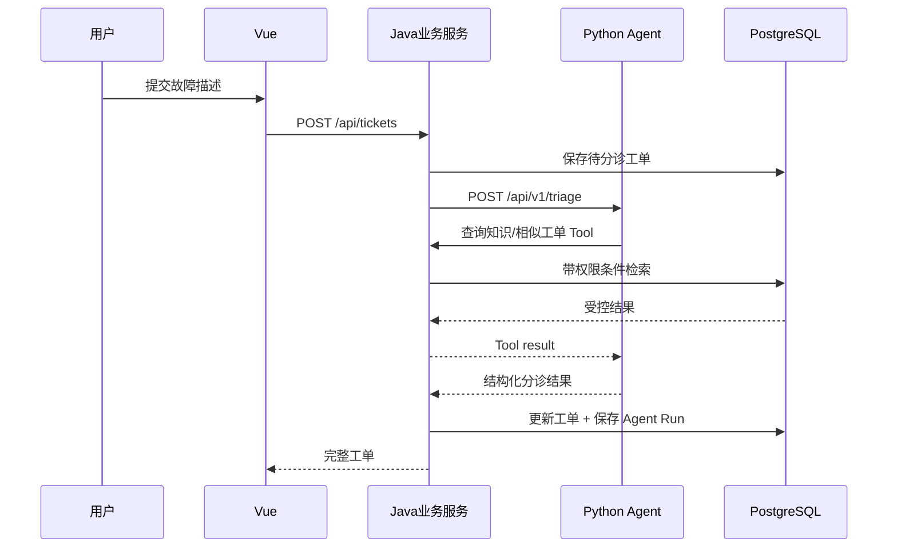

# 架构说明

## 服务边界

- `business-service`：业务事实唯一来源。负责工单状态、数据权限、审批、审计和事务。
- `agent-service`：不直接修改业务数据库。所有查询和动作都通过 Java 提供的受控 Tool API。
- `web`：只调用 Java 公共 API，不直接调用 Agent，避免绕开业务权限。

## 一次智能分诊的时序

## 关键设计原则

1. 模型输出永远视为不可信输入，Java 使用枚举和 Bean Validation 二次校验。
2. Agent 无数据库写权限，避免模型绕过业务规则。
3. 查询工具可自动执行；修改优先级、分派等中风险工具需要审计；关闭工单等高风险工具需要审批。
4. 每次 Agent 运行保存输入、输出、耗时、模式和错误，便于评测与重放。
5. 无模型密钥时使用规则模式，确保面试现场可稳定演示。

